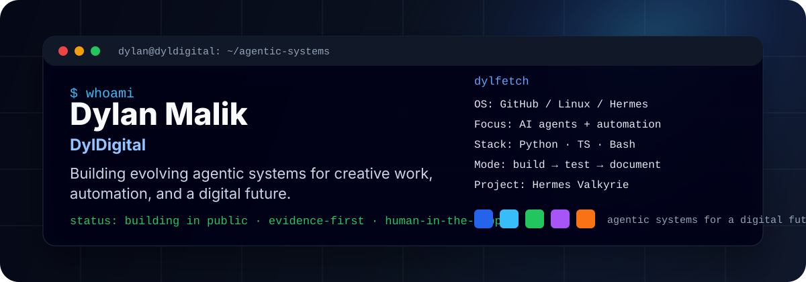

<div align="center">



# Dylan Malik · DylDigital

**Building evolving agentic systems for creative work, automation, and a digital future.**

</div>

---

I’m building DylDigital as my public home for the AI systems, automation workflows, and creative tools I’m testing in real time. The goal is simple:

This platform is to build and share useful systems, and document what actually holds up outside the demo.

```txt
Now building: AI agents · workflow automation · creative systems
How I work: build in public · test with proof · document the rough edges
Proof lives in: repos · demos · logs · writeups · working tools
```

## Featured build

### [Hermes Valkyrie](https://github.com/DylDigitals/hermes-valkyrie)

A portable loadout system for launching Claude Code and Codex through Hermes-managed terminal workflows.

It is built around visible agent sessions, repeatable launches, structured closeouts, and safer human-in-the-loop coding work.

## Stack I’m working with

Claude Code · Hermes Agent · Codex · Python · TypeScript · Node.js · Rust · Bash · Linux · Docker · GitHub Actions

## Follow the Work

I’m using this account to build and store my work. Reach out to me and check out my other social media channels.

Social links coming soon:

- Website / link hub: coming soon
- X / Twitter: coming soon
- YouTube: coming soon
- TikTok: coming soon
- Instagram: coming soon
- LinkedIn: coming soon

---

<div align="center">

**DylDigital** — building in public, one useful system at a time.

<!-- PROFILE_REFRESH: 2026-08-15 -->

</div>
